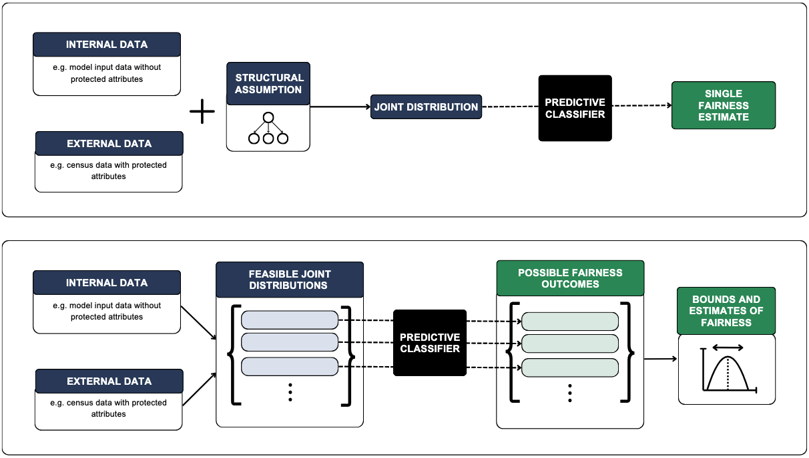

# Beyond Internal Data: Bounding and Estimating Fairness from Incomplete Data

<div align="center">

  [](#)
  [](https://pytorch.org/)
  [](https://opensource.org/licenses/MIT)
</div>

## Overview
<p align="center">
  
</p>
Figure 1: Illustration of our approach to bound and estimate fairness from incomplete data. The
internal dataset (e.g., from a bank) contains non-protected attributes like savings and occupation,
but lacks protected attributes such as ethnicity. A separate external public dataset includes protected
attribute ethnicity and overlaps partially with the internal dataset (e.g., occupation attribute is common
in both datasets). Top: The first approach assumes structural or independence assumptions to produce
a single estimated joint distribution, and therefore a single fairness estimate. Bottom: The second
approach uses the marginal distributions from both sources to estimate the set of joint distributions
consistent with the observed marginals. This allows fairness metrics to be computed over the space of
feasible distributions, enabling bounding and estimation of fairness even in the absence of complete
data.
<br />

## Abstract
Ensuring fairness in AI systems is critical, especially in high-stakes domains such as lending, hiring, and healthcare. This urgency is reflected in emerging global regulations that mandate fairness assessments and independent bias audits. However, procuring the necessary complete data for fairness testing remains a significant challenge. In industry settings, legal and privacy concerns restrict the collection of demographic data required to assess group disparities, and auditors face practical and cultural challenges in gaining access to data. In practice, data relevant for fairness testing is often split across separate sources: internal datasets held by institutions with predictive attributes, and external public datasets such as census data containing protected attributes, each providing only partial, marginal information. Our work seeks to leverage such available separate data to estimate model fairness when complete data is inaccessible. We propose utilising the available separate data to estimate a set of feasible joint distributions and then compute the set plausible fairness metrics. Through simulation experiments, we demonstrate that we can derive meaningful bounds on fairness metrics and obtain reliable estimates of the true metric. Our results demonstrate that this approach can serve as a practical and effective solution for fairness testing in real-world settings where access to complete data is restricted.

## Project Structure

```
📦 fairness-incomplete-data/
├── docs/                  # Documentation files
├── experiments/           # Scripts for simulation and real world experiments 
├── finalfigs/             # Figures under development
├── paperfigs/             # Figures for publication
├── real_data/             # Raw and process data, along with processing script
├── results/               # Generated results 
├── src/                   # Core source code
│   ├── data /              # Code for data processing and obtaining distributions
│   ├── joint_est_with_assum/  # Code for structural assumption method
│   └── joint_feasible_set/    # Code for feasible set method
├── test/                  # tests scripts
├── README.md              # This file
├── run_and_plot.py        # Run and plot for simulation experiments
├── plot_real_data_bounds.py   # Run and plot for real data experiments
├── paper_visualisations.py    # Code for publication plots
├── pyproject.toml         # Project configuration (poetry)
└── poetry.lock            # Dependency lock file
```

## Results and Plots
The results are saved as .csv files in the results/ directory. You can use the provided plotting functions provided in paper_visualisations.py to visualise the distributions and fairness metrics.

## Installation and Setup with Poetry
This project uses [Poetry](https://python-poetry.org/) for dependency management and virtual environment setup.

If you don’t already have Poetry installed, you can install it using the following command:
```bash
curl -sSL https://install.python-poetry.org | python3 -

poetry install
poetry shell
